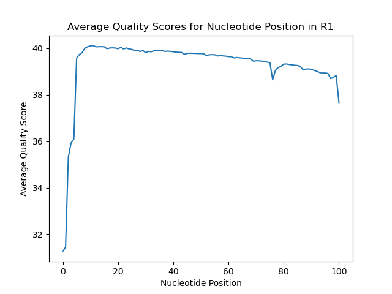
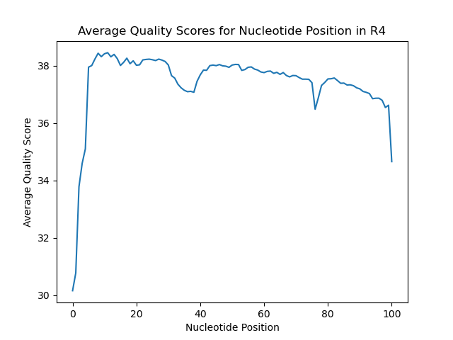

# Assignment the First

## Part 1
1. Be sure to upload your Python script. Provide a link to it here: https://github.com/julhays/Demultiplex/blob/master/Assignment-the-first/qual_dist.py

| File name | label | Read length | Phred encoding |
|---|---|---|---|
| 1294_S1_L008_R1_001.fastq.gz | forward read | 101 | Phred+33 |
| 1294_S1_L008_R2_001.fastq.gz | barcode 1 | 8 | Phred+33 |
| 1294_S1_L008_R3_001.fastq.gz | barcode 2 | 8 | Phred+33 |
| 1294_S1_L008_R4_001.fastq.gz | reverse read | 101 | Phred+33 |

2. Per-base NT distribution
    1. 
    2. 
    3. 
    4. 
    
## Part 2
1. Define the problem

Given 4 FASTQ files (2 with biological reads and 2 with index reads) and a list of acceptable matched indexes, write a script that demultiplexes the reads and reports index-hopping and low quality index reads.

2. Describe output

The script will output the following files:
* an R1 and R2 file per matching index pair
* an R1 and R2 file with hopped index pairs
* an R1 and R2 file with unknown or low quality index pairs (don't match the acceptable index list or contain an N)

All files should have the sequence of the index pairs in the header of both reads

The script will also output some statistics:
* the number of read pairs with matching indexes per index pair
* the number of read pairs with index hopping per index pair
* the number of read pairs with unknown indexes

3. Upload your [4 input FASTQ files](../TEST-input_FASTQ) and your [>=6 expected output FASTQ files](../TEST-output_FASTQ).


4. Pseudocode
```
#make list of acceptable indexes called indexes
while read indexes.txt:
    for line in indexes.txt:
        extract index sequence and add to indexes

#create dictionaries to keep track of statistics as it goes
matched = {} # stores the acceptable indexes as keys and the number of correctly paired occurances as values
hopped = {} # stores the acceptable indexes as keys and the number of incorrectly paired occurances as values
unknown = 0 # integer count of the number of unknown pairs

#parse through input files and sort into respective output files
#while doing this keep count of the occurance of a match or mismatch for each index pair
while read R1, R2, R3, R4 file:
    while True:

        extract a fastq record (4 lines) for each file and store in a list

        if all the lines in each file are empty:
            break

        new header 1, new header 2 = barcodes_to_header(first line of R1 record, first line of R4 record, second line of R2 record, second line of R3 record) 
        
        if line 2 of R2 not in indexes or line 2 of R3 not in indexes:
            write R1 and R4 record with new headers to unknown_R1.fq and unknown_R2.fq
            increment unknown by 1

        low quality = low_qual(forth line of R2 record, forth line of R3 record)

        if low quality:
            write R1 and R4 record with new headers to unknown_R1.fq and unknown_R2.fq
            increment unknown by 1

        reverse compliment = rev_comp(second line of R2 record, second line of R3 record)

        if not reverse compliment:
            write R1 and R4 record with new headers to hopped_R1.fq and hopped_R2.fq
            if second line of R2 record in hopped dictionary:
                increment value by 1
            else:
                insert second line of R2 record into hopped dictionary with a value of 1

        else:
            write R1 and R4 record with new headers to {second line of R2 record}_R1.fq and {second line of R2 record}_R2.fq
             if second line of R2 record in matched dictionary:
                increment value by 1
            else:
                insert second line of R2 record into matched dictionary with a value of 1

#print statistics
print "Index    Matched    Hopped"
for barcode in indexes:
    print barcode, value in matched, and value in hopped if they exist (tab separated)

print "Number of read pairs with unknown indexes"
print unknown

```

5. High level functions. For each function, be sure to include:
    1. Description/doc string
    2. Function headers (name and parameters)
    3. Test examples for individual functions
    4. Return statement
```
def barcodes_to_header(R1_head: str, R4_head: str, R2_seq: str, R3_seq: str) -> str, str:
    ```Takes in the R1 and R4 header and appends the barcode sequences 
    listed in R2 and the reverse complement of R3 to the end of the file header to make it headerBARCODE1-rcBARCODE2```
    return R1_head, R4_head
Input: ('@K00337:83:HJKJNBBXX:8:1101:1265:1191 1:N:0:1', '@K00337:83:HJKJNBBXX:8:1101:1265:1191 4:N:0:1', 'AAAAAAAA', 'TTTTTTTT')
Expected output: '@K00337:83:HJKJNBBXX:8:1101:1265:1191 1:N:0:1AAAAAAAA-AAAAAAAAA', '@K00337:83:HJKJNBBXX:8:1101:1265:1191 4:N:0:1AAAAAAAA-AAAAAAAAA'

def low_qual(R2_qual: str, R3_qual: str) -> bool:
    ```Takes in the barcode quality score lines in R2 and R3 and returns True if 
    the average quality score of either does not meet or exceed the cutoff```
    return True or return False
Input: ('!!!!!!!!', '!!!!!!!!')
Expected output: True

def rev_comp(R2_seq: str, R3_seq: str) -> bool:
    ```Takes in the barcode sequences listed in R2 and R3 and returns True if 
    they are reverse compliments and False if not```
    return True or return False
Input: ('GTAGCGTA', 'TACGCTAC')
Expected output: True

```
